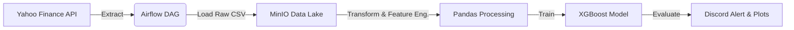

# 📈 End-to-End MLOps Stock Prediction Pipeline


An automated Machine Learning pipeline that forecasts stock market volatility using **Apache Airflow**, **MinIO (Data Lake)**, and **XGBoost**. The system fetches real-time financial data, calculates technical indicators (RSI, Bollinger Bands), trains a regression model, and delivers performance metrics via **Discord Webhooks**.

---

## 🏗️ Architecture

The pipeline is fully containerized using Docker and follows a modern **Extract-Load-Transform-Train (ELTT)** architecture:



## 🚀 Key Features

* **Orchestration:** Apache Airflow manages the DAG execution, ensuring data dependencies and retries.
* **Data Lake Integration:** Simulates an AWS S3 environment using **MinIO** for storing raw CSVs, processed datasets, and model artifacts.
* **Feature Engineering:** Implements key financial indicators using **Industrial Mathematics** principles:
* **RSI (Relative Strength Index):** Measures momentum to identify overbought/oversold conditions.
* **Bollinger Bands:** Uses standard deviation () to measure market volatility.
* **SMA (Simple Moving Average):** Smooths out price noise (10-day & 50-day windows).


* **Automated Alerting:** Sends real-time training results (RMSE, MSE) and visualization plots to a Discord channel.

---

## 📊 Results & Performance

The model was tested on high-volatility tech stocks. **NVIDIA (NVDA)** showed significantly better predictability due to its strong momentum trends compared to **Tesla (TSLA)**.

| Ticker | RMSE (Error) | MSE | Verdict |
| --- | --- | --- | --- |
| **NVDA** | **$12.85** | 165.18 | ✅ **High Accuracy** (~9% Error) |
| **TSLA** | $42.58 | 1813.30 | ⚠️ High Volatility (~23% Error) |

### Sample Visualization

*Generated automatically by Matplotlib and stored in MinIO.*

> 

---

## 🛠️ Tech Stack

* **Infrastructure:** Docker, Docker Compose
* **Orchestration:** Apache Airflow
* **Storage:** MinIO (S3 Compatible Object Storage)
* **Machine Learning:** XGBoost, Scikit-Learn
* **Data Processing:** Pandas, NumPy
* **Visualization:** Matplotlib
* **Alerting:** Discord Webhook API

---

## ⚡ Quick Start

### Prerequisites

* Docker & Docker Compose installed.

### Installation

1. **Clone the Repository**
```bash
git clone [https://github.com/YOUR_USERNAME/airflow-stock-predictor.git](https://github.com/YOUR_USERNAME/airflow-stock-predictor.git)
cd airflow-stock-predictor

```


2. **Configure Environment**
Create a `.env` file or update `dags/stock_prediction_dag.py` with your Discord Webhook URL.
3. **Launch the Pipeline**
```bash
docker-compose up -d --build

```


4. **Access the UIs**
* **Airflow UI:** `http://localhost:8080` (User/Pass: `admin`/`admin`)
* **MinIO UI:** `http://localhost:9001` (User/Pass: `minio_admin`/`minio_password`)


5. **Trigger the DAG**
Go to the Airflow UI, unpause the `stock_prediction_plus_visuals` DAG, and click the **Play** button.

---

## 📂 Project Structure

```bash
├── dags/
│   └── stock_prediction_dag.py  # The Core Pipeline Logic
├── logs/                        # Airflow Logs
├── plugins/                     # Custom Airflow Plugins
├── docker-compose.yaml          # Container Orchestration
├── Dockerfile                   # Custom Airflow Image Definition
└── requirements.txt             # Python Dependencies

```

## 🔮 Future Improvements

* Implement **Hyperparameter Tuning** using Optuna.
* Deploy model as a REST API using **FastAPI**.
* Add **Sentiment Analysis** from financial news to improve accuracy on volatile stocks like TSLA.

---

### Author

**Adoption Oluwasomidotun**
*Industrial Mathematics Graduate | Data Engineer | AI Enthusiast*

```
